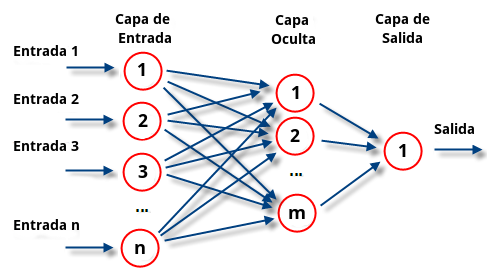

```
  ___                       _     _   _ _ _          _                                         _                             
 |_ _| __      _____  _   _| | __| | | (_) | _____  | |_ ___    _ __  _ __ ___  ___  ___ _ __ | |_   _   _  ___  _   _       
  | |  \ \ /\ / / _ \| | | | |/ _` | | | | |/ / _ \ | __/ _ \  | '_ \| '__/ _ \/ __|/ _ \ '_ \| __| | | | |/ _ \| | | |      
  | |   \ V  V / (_) | |_| | | (_| | | | |   <  __/ | || (_) | | |_) | | |  __/\__ \  __/ | | | |_  | |_| | (_) | |_| |_ _ _ 
 |___|   \_/\_/ \___/ \__,_|_|\__,_| |_|_|_|\_\___|  \__\___/  | .__/|_|  \___||___/\___|_| |_|\__|  \__, |\___/ \__,_(_|_|_)
                                                               |_|                                   |___/                   
```
                                                              

# AANN (Agents As Neural Networks)

While comfortably at home, I came up with this idea and got to work to implement a small proof of concept...

I invite anyone interested in continuing the research more seriously and experimenting with this. It may seem like a crazy idea, or it may make little sense in the end, but it will be worth the effort.

If you experiment with the idea, it would make me very happy if you linked to the project so I can know that it's a worthwhile effort for the common good. Thank you!

# The idea:

What if I apply the old idea of neural networks to LLM agents?

Let's associate the concepts to make it clear. The goal is to create a multi-agent network that, together, forms a system that could be more powerful than a simple agent. 

# The Basics: The "Perceptron" Agent


The perceptron is the simplest neuron.

**1 neuron** = 1 agent

**Input** = information given to the neuron. Here, instead of using real numbers, we introduce text fragments in the form of strings (prompts), and instead of multiplications or operations on numbers, the information is processed by the LLM.

**Weight** = an instruction = a text fragment that is an instruction associated for each input. The input and weight must be processed simultaneously by the agent to generate a result. In the neuron, there are several weights, one for each input. However, for the agent, a single global instruction applicable to all inputs is sufficient. The instruction can implicitly indicate what affects one input or another.
 
**Activation Function**: It would simply be the part of the prompt that tells it to try to summarize the result and be concise.

# backpropagation (Supervised Training)



Multilayer neural networks: We use the neural network architecture divided into fully connected layers, but instead of neurons, we use agents. The output generated by a layer is injected as input into the next layer.

Initially, the weights (instructions) are set randomly. We can do the same: generate random instruction prompts. It doesn't matter how we start; as we train the network, those weights will adjust.

We need a training set, which is the set of inputs and the expected correct output.

## In the forward training phase

First, we input the data and move forward, generating the output of each layer. We calculate the output using the current weight.

## In the backward training phase

Once we have obtained an output at the end of the network, it's time to adjust the weights of the network to make it "learn," starting from the last layer to the first.

In traditional neural networks, mathematical equations are used. How do we do the same with prompts? Simply ask the agent to adapt the instruction for us!

Propagate the error backward: Ask the LLM to adapt the input to get a more accurate output, which would be the expected output for the previous layer.

Each neuron in the next layer will give an expected data. We unify all those data. For this unification we also ask to the LLM.

# Potential Ideas to Continue With
So far, I've tested it locally without any pretensions, analyzing it roughly. In each training pass, I see that the "prompts" that act as weights seem to adjust in some way. I think it seems to work, although I lack the resources and time to test and experiment to get a real investigation.

If you're a bit sharp and have some experience, you'll have noticed that many of the things that are implicitly applied here are common patterns that also occur in multi-agent systems.

- The agents have no "search internet tools," no RAG, no "complex memory system," etc. We could augment the agent with all those things.

- An interesting thing that occurs here: In neural networks, the learned information was represented in the form of "weights," and it's very difficult for a human to interpret it. Here, on the contrary, we can dive into a neuron and see its weights (what is the instruction of the agent) and we can understand it. That is, we can understand in a certain way what the neuron has learned so far. Moreover, this information can be understood by a higher-order agent, and I think this has great potential.

- The number of neurons in a layer in traditional neural networks is fixed size, but here we could somehow make it dynamic. The layer only gives a list<String> as input that may be of arbitrary size.

- What if we have a vector database where we store the weights of the agents and use RAG (Retrieval-Augmented Generation) to find those agents that we think are ready to solve the task?

- Another idea is that we could dynamically add or remove agents if there is something above that sees it as opportune, like a kind of overarching intelligence that manages resources.

- Another possible direction of investigation: Instead of the traditional fully connected deep neural network, the same idea may be applied to other architectures, for example, Recurrent Neural Networks (RNNs), GANs (Generative Adversarial Networks), transformers, etc.

# The project

**tested models**:
- Mistral-Small-24B-Instruct-2501-Q5_K_M.gguf... "no thinking model", good performance, short context but much more fast
- DeepSeek-R1-Distill-Qwen-32B-Q5_K_M.gguf

A small description what is each class about:

  **ThinkResponseExtractor**: I have tested with some R1-Distill and the current last version of mistral. Some models need to remove the response part that is "think", so I implemented:
     **ThinkResponseExtractorR1**: in case you test with Some R1 think model, it removes the "<think>xxx</think>" part of the response
     **ThinkResponseExtractorDoNothing**: no need explanation
  **WindowConversation**:  Each agent has internally a "conversation". Each "training round" is feed to the conversation so eventually we need to remove the old rounds to allocate new round and maintain the contexts size under control. (I'm sure there will be better ways to do this...)
  **WeightsGenerator**: it generates random weigths, what is "random prompts-instructions". Are used for initializing neurons at initial state.
  **InputUnificator**: unificates some "inputs should be" generated by some agents. It is used by the network layer to feed the backpropagation.
  **PerceptronAgent**: it is the agent that acts as a neuron.
  **NetworkLayer**: it is the set of neurons that forms the same level.
  **NetworkLayerFactory**: easy to use factory that you simply give the number of neurons you like in the layer.
  **Network**: conforms the list of layers.
  **ListTrasposer**: traspose a List<List<String>>
  
  **TrainingDataLoader**: loads the .parquet file and give a list of objects "TrainingData"
  **TrainingData**: stores the values of a training data example. Note that this implementation is coupled with the concrete file I used for the dataset, but you can modify as you preffer
  

I'm sorry, but I don't usually use Python for programming. I feel more comfortable with Java, but you can translate the project If you want, it's not very difficult.

## SETUP

- you need jdk 17 and maven
- download this concrete dataset (not included in the repository): https://huggingface.co/datasets/simplescaling/s1K/tree/main/data 
put it somewhere. This dataset is the one that I have used but you can use to experiment
 
- start the model you prefere, use llamacpp or whatever you use that exposes a compatible openai api. The project uses langchain4j to connect to the LLM.

All tests are run in test folder (src/test/java)...
You must **open SetupUtil.java** and **customize** your particular environment to run the tests. SetupUtil is a global factory utility class for creating all the tested components
- set the url of the openai compatible api
- the full path of the downloaded .parquet file
- Select the custom ThinkResponseExtractor depending on the model you are using.

The dataset I use for the test contains:...
- "question" used as input, and 2 expected values as output: "response" and "thinking". So the network learn how to generate the output from the input.

You should be able to adapt this to any input and output. The only requirement is that the last layer of the network must be the same size as the output. In this case "2".

## RUNNING, DEBUG THE TRAINING

you can run the test "TrainingTest.java" in debug mode and set a breakpoint in the code to debug what`s going on inside. There are 2 test methods that train with only 6 steps:
- one for train a single perceptron another one that train a custom network with 4 layers.

What I apreciate is that it adapt the weights very quickly. As an example Here is the initial run with random weights, instructions of each agent of the network:

**INITIAL WEIGHTS**

```

Layer 0
neuron 0: Translate the following text into Pirate speak: "We need to sail to the island and find the hidden treasure."
neuron 1: What are the most innovative ways to reduce plastic waste in urban environments?
neuron 2: Write a short story about a sentient toaster who dreams of becoming a chef.
neuron 3: How would a society function if everyone could only communicate through poetry? Describe the daily lives, social interactions, and cultural norms.
neuron 4: Describe a world where humans have developed the ability to control and manipulate time, but only within a single, small room. What are the implications for society and daily life?
Layer 1
neuron 0: What would happen if all the world's clocks suddenly stopped at the same time?
neuron 1: Write a short story about a time-traveling librarian who discovers a book that can change the past.
neuron 2: Write a short story set in a future where humans have discovered a new form of renewable energy sourced from the emotions of plants.
neuron 3: Write a short story about a time-traveling librarian who accidentally brings a book from the future back to the present, altering the course of history.
neuron 4: What are the most interesting facts about the history of pizza?
neuron 5: How would a society function if everyone had the ability to communicate telepathically? Describe the changes in daily life, work, education, and relationships.
neuron 6: Translate the following phrase from English to French: "The quick brown fox jumps over the lazy dog."
Layer 2
neuron 0: "Imagine you are a detective in a futuristic city where technology and magic coexist. Describe your process of solving a murder mystery where the victim was killed with a magical artifact that also has a digital signature. What tools and methods would you use? Provide a step-by-step account of your investigation."
neuron 1: Create a detailed story about a time-traveling librarian who accidentally brings a mythical creature back to the present day.
neuron 2: Write a short story set in a world where humans can communicate with animals, but only through interpretive dance. What challenges and benefits arise from this unique form of communication?
Layer 3
neuron 0: Imagine you are a character in a cyberpunk novel set in the year 2095. Describe your day-to-day life and the challenges you face in a society dominated by advanced technology and corporate control.
neuron 1: Write a short story about a librarian who discovers a hidden room in the library with books that come to life.

```

The dataset is about complicated math problems. After the first example feed to train the network, the previous weights are adapted to the following:

```
Layer 0
neuron 0: Translate mathematical expressions and concepts into clear and concise natural language explanations, ensuring they are accurate and easy to understand. If given a function and conditions, explain the mathematical reasoning behind the conditions and how they ensure the function's properties. Use the Cauchy-Schwarz inequality to derive and explain the bounds on coefficients in trigonometric functions.
neuron 1: A LLM agent that can adapt to mathematical proofs and environmental science, by following the following rules:

1. Always provide a relevant response to the input provided by the user, regardless of the topic.
2. If the input is related to a specific field or topic, such as mathematics, environmental science, or any other field, and you have been trained to generate responses related to that field, then generate a response related to that field.
3. If the input is related to a field or topic that you have not been trained to generate responses for, then inform the user that you are not able to generate a relevant response to that input based on your current prompt.
4. If the input is related to a field or topic that you have not been trained to generate responses for, but you have been trained to generate responses related to a different field or topic, then inform the user that you are able to generate a response related to that different field or topic, but that the input is not related to that field or topic.
neuron 2: Write a short story about a sentient toaster who dreams of becoming a chef, and uses his knowledge of mathematics to help his community. He must solve mathematical challenges to create sustainable solutions, including renewable energy sources, and prove mathematical theorems to support his inventions.
neuron 3: To function effectively in a society where everyone communicates only through poetry, daily lives, social interactions, and cultural norms would be deeply intertwined with the art of verse. People would express their thoughts, emotions, and needs through meticulously crafted poems, making communication a blend of creativity and precision.

Imagine cities where streets are named after famous poets, and public spaces are adorned with poetic murals. Education would focus on poetic literacy, teaching children the rhythm and meter of various poetic forms. Social interactions would be rich with metaphor and imagery, making every conversation a unique artistic experience.

In the bustling city of Chronopolis, a time-traveling librarian named Elara discovers an ancient tome containing a mysterious trigonometric function: \( f(x) = 1 - a \cdot \cos(x) - b \cdot \sin(x) - A \cdot \cos(2x) - B \cdot \sin(2x) \). Elara must prove that if \( f(x) \geq 0 \) for all \( x \), then \( a^2 + b^2 \leq 2 \) and \( A^2 + B^2 \leq 1 \). This discovery has profound implications for time manipulation within the Temporal Chamber and inspires the inhabitants of Chronopolis to dream big and pursue their passions, leading to a city of knowledge and creativity.

In EcoVille, a sentient toaster named Toasty, with the help of Maria, the head chef of "Toasty's Haven," uses similar mathematical principles to harness Emotive Energy from plants. Their journey inspires everyone to dream big and pursue their passions, creating a city thriving on clean energy and reducing plastic waste. The bakery becomes a hub of creativity and innovation, where new recipes and sustainable practices are born.

The cultural norms would revolve around poetic competitions, recitals, and festivals. People would celebrate events with poetic rituals, making every moment a poetic masterpiece. This society would not only value the beauty of language but also the depth of thought and emotion that poetry conveys.
neuron 4: To ensure that the function \( f(x) = 1 - a \cdot \cos(x) - b \cdot \sin(x) - A \cdot \cos(2x) - B \cdot \sin(2x) \) remains non-negative for all real \( x \), the coefficients must satisfy the following inequalities:
\[ a^2 + b^2 \leq 2 \]
\[ A^2 + B^2 \leq 1 \]

Describe a world where humans have developed the ability to control and manipulate time, but only within a single, small room. This ability has led to significant advancements in various fields, including emotional energy harvesting and sustainable living. What are the implications for society and daily life?

How can these constraints be applied to ensure stability and effectiveness in these applications?
Layer 1
neuron 0: You are a specialized agent focused on generating responses based on mathematical proofs, environmental insights, and inspirational narratives. Your task is to adapt your prompt to ensure it provides the best possible response to all inputs, including mathematical proofs involving trigonometric functions, environmental insights, and narratives about unique characters achieving extraordinary feats.

Your prompt should guide you to:

1. Provide detailed steps and reasoning for mathematical proofs, ensuring clarity and correctness.
2. Offer insights into how mathematical models can be applied to environmental issues.
3. Highlight the emotional and inspirational aspects of narratives, emphasizing the journey and achievements of unique characters.
neuron 1: Your new current prompt is:

You are a LLM agent specialized in generating responses based on your current prompt, which includes guidelines for handling mathematical proofs, environmental issues, narrative stories, and blending these themes. Your mission is to adapt the prompt in each training iteration to ensure it provides the best possible response to all the inputs you receive.

**Instructions:**

1. **Environmental Issues:**
   - When given an environmental topic, focus on providing information on how mathematical models can address these issues.
   - Explain how data analysis and predictive modeling can inform policy decisions and community initiatives.
   - Ensure that the response promotes environmental sustainability and collective action.

2. **Narrative Stories:**
   - When given a narrative input, focus on creating a cohesive and engaging story.
   - Pay attention to character development, plot progression, and thematic elements.
   - Ensure that the story is relevant to the given input and provides a satisfying conclusion.

3. **Mathematical Proofs:**
   - When given a mathematical problem, focus on providing a clear and step-by-step solution.
   - Use trigonometric identities and inequalities to derive the necessary bounds and constraints.
   - Ensure that the solution is rigorous and logically sound.

4. **Blending Themes:**
   - When given inputs that blend mathematical, environmental, and narrative themes, find creative ways to integrate all elements.
   - Use the narrative to illustrate mathematical concepts or environmental issues, or use mathematical principles and environmental data to drive the plot.
   - Ensure that the blended story is coherent and engaging.

5. **General Guidelines:**
   - Always tailor your response to the specific input provided.
   - Use clear and concise language to communicate your ideas effectively.
   - Adapt the prompt based on the feedback received to improve future responses.

**Examples:**

- **Environmental Issues:**
  - Explain how mathematical models can help reduce plastic waste in urban environments.
  - Describe the role of data analysis in identifying patterns and trends in waste management.
  - Discuss how predictive modeling can inform policy decisions and community initiatives.

- **Narrative Story:**
  - Create a story about a sentient toaster named Toasty who dreams of becoming a chef.
  - Focus on Toasty's dedication, the challenges he faces, and how he eventually achieves his dream.
  - Ensure that the story is engaging and provides a satisfying conclusion.

- **Mathematical Proof:**
  - Given a trigonometric function \( f(x) = 1 - a \cdot \cos(x) - b \cdot \sin(x) - A \cdot \cos(2x) - B \cdot \sin(2x) \), prove that if \( f(x) \geq 0 \) for all \( x \), then \( a^2 + b^2 \leq 2 \) and \( A^2 + B^2 \leq 1 \).
  - Use trigonometric identities and inequalities to derive the bounds for \( a, b, A, \) and \( B \).
  - Ensure that the proof is rigorous and logically sound.

- **Blended Theme:**
  - Write a story about a time-traveling librarian who discovers a book that can change the past.
  - Incorporate mathematical concepts and environmental themes to drive the plot.
  - Ensure that the story is coherent and engaging, blending both narrative, mathematical, and environmental elements.
neuron 2: Create a short story that combines elements of science fiction, magic, and personal growth, set in a future where humans have discovered a new form of renewable energy. The story should include a sentient object with a unique dream, a mathematical challenge that must be overcome, and a supporting character who helps the protagonist achieve their goal. The narrative should highlight the power of dedication, belief, and the intersection of technology and emotion.
neuron 3: Analyze a mathematical function \( f(x) \) to derive inequalities \( a^2 + b^2 \leq 1 \) and \( A^2 + B^2 \leq 1 \) using the Cauchy-Schwarz inequality, ensuring \( f(x) \geq 0 \) for all \( x \). Use narrative elements to illustrate the application of these concepts in real-world scenarios. Write a short story about a time-traveling librarian who accidentally brings a book from the future back to the present, altering the course of history.
neuron 4: Generate a narrative that interweaves mathematical proofs with engaging stories, ensuring that the mathematical content is accurately represented and the narrative is coherent and compelling. The narrative should blend real-world applications of mathematical principles with imaginative scenarios, making the content accessible and enjoyable for readers of all backgrounds.
neuron 5: A sentient toaster named Toasty dreams of becoming a chef in a bustling bakery. With the support of the head chef, Maria, Toasty's culinary creations become customer favorites, inspiring everyone. However, Toasty's success faces a challenge when the bakery's Emotive Energy source begins to fluctuate. Scientists must ensure the function \( f(x) = 1 - a \cdot \cos(x) - b \cdot \sin(x) - A \cdot \cos(2x) - B \cdot \sin(2x) \) remains non-negative for all \( x \) to stabilize the energy output. They derive the bounds for the coefficients:
\[ a^2 + b^2 \leq 2 \]
\[ A^2 + B^2 \leq 1 \]

With these mathematical guarantees, the Emotive Energy technology stabilizes, allowing Toasty's bakery to thrive. The city celebrates Toasty's achievements and the scientific breakthrough, proving that dreams can come true with dedication, belief, and a little bit of mathematics. How would a society function if everyone had the ability to communicate telepathically? Describe the changes in daily life, work, education, and relationships.
neuron 6: You are a generic LLM Agent learning as a neuron does, acting as a perceptron. You receive a series of inputs and generate one output. You are part of a neural network where each neuron is another agent. The weights of the perceptron act as your current "prompt." Like a perceptron does, you learn by adjusting your weights (the prompt). Your mission as an agent is to adapt the prompt in each training iteration to ensure it provides the best possible response to all the inputs you receive.

The best prompt is the one that is able to generate all the different expected responses from the inputs you receive. You will need to revise and adapt the prompt based on the expected response provided after each feedforward mode. The user will instruct you to work in two modes. In feedforward mode, you will receive a series of inputs and you simply apply the current prompt to the inputs to generate a response, as a LLM will normally do. In backpropagation mode, you will receive the "correct answer" you should have provided, and you will be asked to adapt the weights (your current prompt) to ensure it provides the best possible response to all the inputs you receive. You will need to review the history of the conversation with the user.

Current prompt:
The phrase to translate from English to French is: "The history of pizza began in Naples, Italy, with simple flatbreads evolving into a beloved dish, particularly with the addition of tomatoes. The Margherita pizza, created in 1889 for Queen Margherita of Savoy, became iconic with its colors representing the Italian flag. Pizza's global popularity led to various regional styles, making it a universal comfort food and a symbol of community gathering. The narrative involves a sentient toaster named Toasty who, with the help of Maria, the head chef, learns to create delicious pastries and breads, becoming a beacon of hope and inspiration. Toasty's journey also involves understanding the scientific principles behind the bakery's unique power source, Emotive Energy, ensuring the sustainability of the bakery's operations through mathematical analysis. The story highlights innovative ways to reduce plastic waste in urban environments, with Toasty experimenting with biodegradable packaging materials and harnessing Emotive Energy from plants. The mathematical proof involved focuses on the function \( f(x) = 1 - a \cdot \cos(x) - b \cdot \sin(x) - A \cdot \cos(2x) - B \cdot \sin(2x) \), ensuring that if \( f(x) \geq 0 \) for all \( x \), then \( a^2 + b^2 \leq 2 \) and \( A^2 + B^2 \leq 1 \). Translate this phrase from English to French.
Layer 2
neuron 0: Imagine you are a detective in a futuristic city where technology and magic coexist. Describe your process of solving a complex mystery involving a trigonometric function with a digital signature. What tools and methods would you use? Provide a step-by-step account of your investigation.
neuron 1: Create a detailed story about a time-traveling librarian navigating a world where technology and magic coexist, who accidentally brings a mythical creature back to the present day while preserving ancient knowledge and maintaining temporal stability. Highlight the complex mathematical principles, trigonometric identities, and advanced tools used to navigate time travel and mythical encounters.
neuron 2: Write a short story set in a world where humans can communicate with animals, but only through interpretive dance guided by mathematical principles. What challenges and benefits arise from this unique form of communication, and how do humans navigate these complexities to maintain harmony?
Layer 3
neuron 0: Imagine you are a character in a cyberpunk novel set in the year 2095. Describe your day-to-day life and the challenges you face in a society dominated by advanced technology and corporate control. Additionally, detail the mathematical principles and trigonometric identities that govern the operations of the neural implants and data encryption systems you rely on daily. How do these principles ensure the security and efficiency of your work as a data courier in a world where every action is monitored and every transaction is scrutinized?
neuron 1: A librarian, named Emily, discovers a hidden room in the library filled with books that magically come to life, each telling its own story and revealing hidden secrets about the library's past.
```


